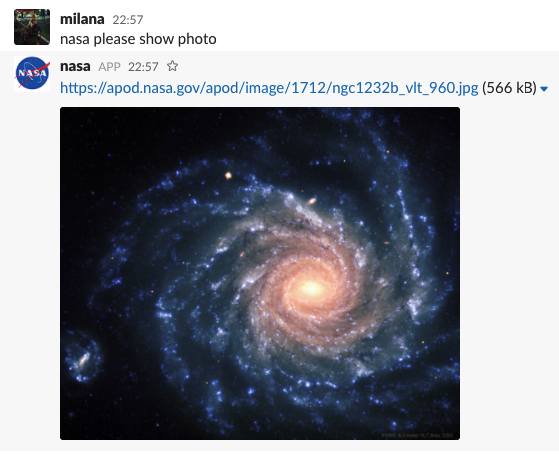

[](https://semaphoreci.com/mstojadinov/nasa)



## Simple Slack Bot - NASA

It uses NASA's most API [APOD].

### Development

While making it I've used Slack's tutorial for [making bots with Ruby](https://github.com/slack-ruby/slack-ruby-bot/blob/master/TUTORIAL.md "Slack-Ruby-Bot Tutorial").

### Running a bot locally

ToDo

```
foreman start
```

### Deploying bot to Heroku

- [ToDo] Configure Heroku toolbelt locally
- From the comfort of your terminal create new app on Heroku

    ```bash
    heroku create <app-name>
    ```
- Add environment variables to this app with commands similar to the following.
We'd like to execute this for every variable listed in our `.env` file.

    ```bash
    heroku config:add ENV_VAR_NAME=<its-value>
    ```

- Deploy it by running the following command locally

    ```bash
    git push heroku master
    ```
https://nasa-apod-bot.herokuapp.com/

### Set up an automatic deployment on Semaphore

If we set up [Semaphore server] for the master branch,
our application will automatically be deployed to Heroku after every green build on master.
Additionally, we can enabled Semaphore's [Scheduled Builds] for this branch.
This should wake up Heroku's dyno with automatic redeploys.
:) and our bot will be active.

[APOD]: https://api.nasa.gov/api.html#apod
[making bots with Ruby]: https//github.com/slack-ruby/slack-ruby-bot/blob/master/TUTORIAL.md
[Semaphore server]: https://semaphoreci.com/docs/deploying-to-heroku.html
[Scheduled Builds]: https://semaphoreci.com/docs/scheduling-builds.html
